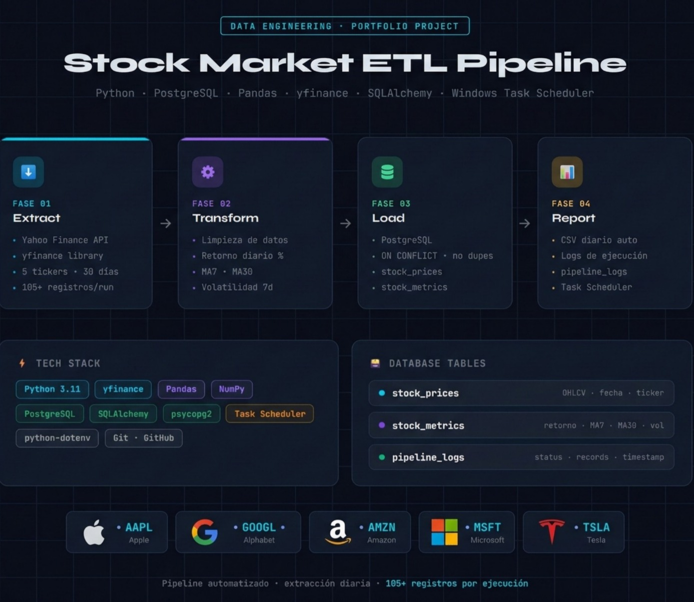

# 📈 Pipeline ETL — Precios del Mercado Bursátil

Pipeline ETL automatizado que extrae precios diarios de acciones desde Yahoo Finance, transforma y enriquece los datos con métricas financieras, y los carga en una base de datos PostgreSQL. Genera reportes CSV diarios de forma automática.

---

## 🏗️ Arquitectura


```
API de Yahoo Finance
        │
        ▼
  [ EXTRACCIÓN ]  ──► yfinance · Python
        │
        ▼
 [ TRANSFORMACIÓN ] ──► Pandas · NumPy
  - Limpieza de datos
  - Retornos diarios
  - Medias móviles (MA7, MA30)
  - Volatilidad (7 días)
        │
        ▼
    [ CARGA ] ──► PostgreSQL
  - stock_prices
  - stock_metrics
  - pipeline_logs
        │
        ▼
  [ REPORTE ] ──► CSV (reports/)
```

---

## 🛠️ Stack Tecnológico

| Capa | Tecnología |
|---|---|
| Lenguaje | Python 3.11 |
| Extracción de datos | yfinance |
| Transformación | Pandas, NumPy |
| Base de datos | PostgreSQL |
| Conector BD | SQLAlchemy, psycopg2 |
| Automatización | Windows Task Scheduler |
| Variables de entorno | python-dotenv |

---

## 📁 Estructura del Proyecto

```
stock_etl_pipeline/
│
├── src/
│   ├── extract.py       # Descarga datos desde Yahoo Finance
│   ├── transform.py     # Limpia los datos y calcula métricas
│   ├── load.py          # Carga a PostgreSQL y genera reportes
│   └── pipeline.py      # Orquesta el flujo ETL completo
│
├── reports/             # Reportes CSV generados automáticamente
├── logs/                # Logs de ejecución (diarios)
├── .env                 # Credenciales de BD (no se sube a GitHub)
├── .gitignore
├── requirements.txt
└── README.md
```

---

## ⚙️ Instalación y Configuración

### 1. Clonar el repositorio
```bash
git clone https://github.com/tu-usuario/stock-etl-pipeline.git
cd stock-etl-pipeline
```

### 2. Crear y activar el entorno virtual
```bash
python -m venv venv
venv\Scripts\activate      # Windows
# source venv/bin/activate  # Mac/Linux
```

### 3. Instalar dependencias
```bash
pip install -r requirements.txt
```

### 4. Configurar variables de entorno

Crear un archivo `.env` en la raíz del proyecto:
```env
DB_HOST=localhost
DB_PORT=5432
DB_NAME=stock_pipeline
DB_USER=postgres
DB_PASSWORD=tu_password_aqui
```

### 5. Configurar la base de datos PostgreSQL

Conectarse a PostgreSQL y ejecutar:
```sql
CREATE DATABASE stock_pipeline;
```

Luego crear las tablas ejecutando el script en `/sql/schema.sql`.

---

## 🚀 Ejecutar el Pipeline

```bash
python src/pipeline.py
```

### Salida esperada en consola:
```
2026-03-06 10:30:00 [INFO] INICIANDO PIPELINE ETL - STOCK PRICES
2026-03-06 10:30:00 [INFO] [ FASE 1 ] Extracción de datos...
2026-03-06 10:30:02 [INFO] ✓ AAPL: 21 registros extraídos
2026-03-06 10:30:03 [INFO] ✓ GOOGL: 21 registros extraídos
2026-03-06 10:30:04 [INFO] ✓ AMZN: 21 registros extraídos
2026-03-06 10:30:05 [INFO] ✓ MSFT: 21 registros extraídos
2026-03-06 10:30:06 [INFO] ✓ TSLA: 21 registros extraídos
2026-03-06 10:30:06 [INFO] [ FASE 2 ] Transformación y limpieza...
2026-03-06 10:30:07 [INFO] [ FASE 3 ] Carga a PostgreSQL...
2026-03-06 10:30:09 [INFO] [ FASE 4 ] Generando reporte...
2026-03-06 10:30:09 [INFO] ✅ PIPELINE COMPLETADO — 105 registros cargados
```

---

## 📊 Esquema de la Base de Datos

### `stock_prices`
| Columna | Tipo | Descripción |
|---|---|---|
| id | SERIAL | Clave primaria |
| ticker | VARCHAR(10) | Símbolo bursátil (ej. AAPL) |
| date | DATE | Fecha de la sesión |
| open_price | NUMERIC | Precio de apertura |
| high_price | NUMERIC | Máximo del día |
| low_price | NUMERIC | Mínimo del día |
| close_price | NUMERIC | Precio de cierre (ajustado) |
| volume | BIGINT | Volumen de operaciones |

### `stock_metrics`
| Columna | Tipo | Descripción |
|---|---|---|
| ticker | VARCHAR(10) | Símbolo bursátil |
| date | DATE | Fecha de la sesión |
| daily_return | NUMERIC | Retorno diario porcentual |
| ma_7 | NUMERIC | Media móvil de 7 días |
| ma_30 | NUMERIC | Media móvil de 30 días |
| volatility_7 | NUMERIC | Volatilidad de 7 días |

### `pipeline_logs`
| Columna | Tipo | Descripción |
|---|---|---|
| execution_time | TIMESTAMP | Fecha y hora de ejecución |
| status | VARCHAR | 'success' o 'error' |
| records_loaded | INTEGER | Registros procesados |
| message | TEXT | Detalles o mensaje de error |

---

## ⏰ Automatización — Windows Task Scheduler

El pipeline está programado para ejecutarse diariamente de forma automática mediante el Programador de Tareas de Windows:

- **Programa:** `C:\...\venv\Scripts\python.exe`
- **Argumentos:** `src/pipeline.py`
- **Frecuencia:** Diaria

---

## 📈 Acciones Monitoreadas

| Ticker | Empresa |
|---|---|
| AAPL | Apple Inc. |
| GOOGL | Alphabet Inc. |
| AMZN | Amazon.com Inc. |
| MSFT | Microsoft Corporation |
| TSLA | Tesla Inc. |

---

## 🔮 Mejoras Futuras

- [ ] Incorporar Apache Airflow para la orquestación
- [ ] Migrar almacenamiento a la nube (AWS S3 + Redshift)
- [ ] Agregar dashboard con Metabase o Google Looker Studio
- [ ] Enviar alertas por correo ante volatilidad inusual
- [ ] Ampliar el universo de tickers con filtros por sector

---

## 👤 Autor

**Jorge Intriago**  
[LinkedIn](https://www.linkedin.com/in/jorge-intriago-data/) · [GitHub](https://github.com/jodainlo/)